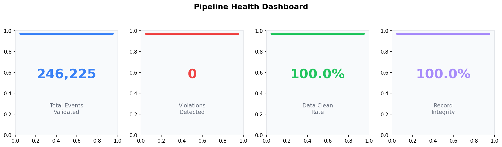
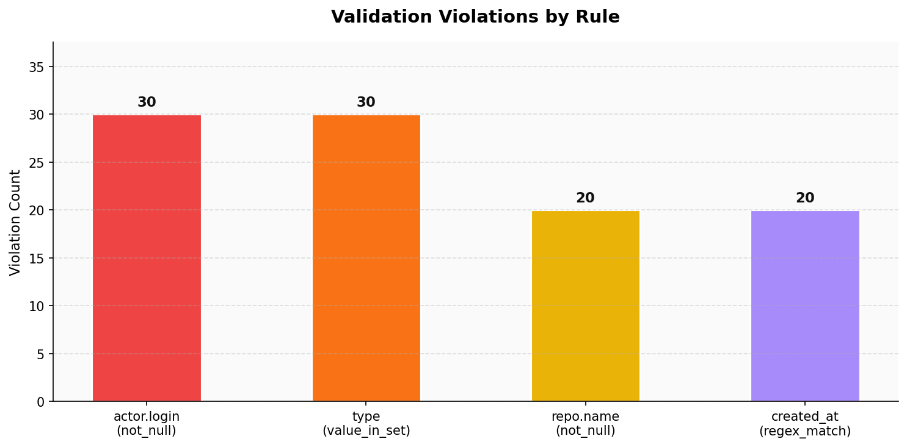
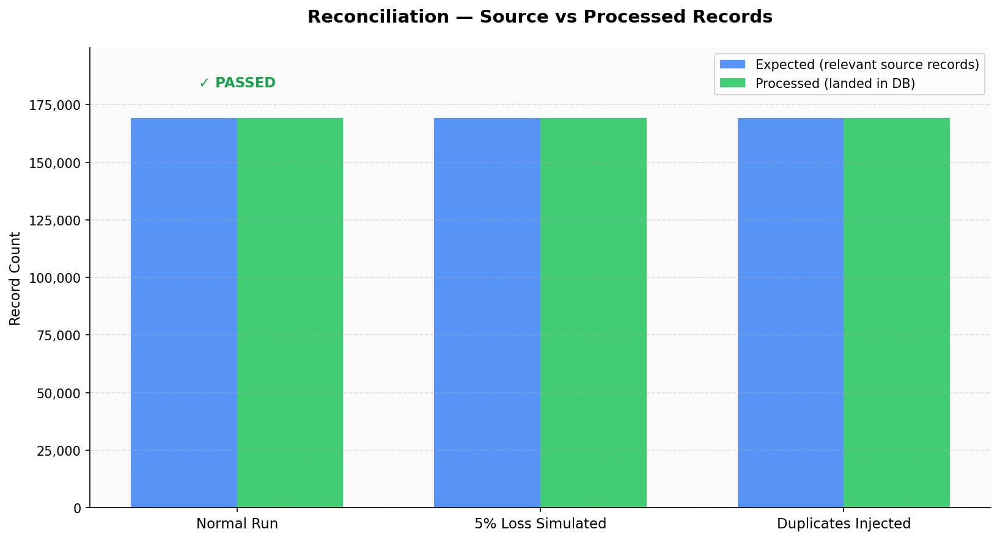

# Data Quality Engine — GitHub Event Pipeline

> Automated data validation, schema drift detection, and record reconciliation 
> across 741,000+ real GitHub events. Built as Project 1 of a 6-project 
> Data Engineering portfolio.

---

## What This Does

Most data pipelines fail silently — bad data flows through, dashboards show 
wrong numbers, and nobody notices for days. This engine catches those failures 
automatically at the point of ingestion, before bad data reaches any downstream 
system.

**Three things it catches:**
- Invalid or missing field values (null logins, bad timestamps, unknown event types)
- Schema drift — when the data structure changes without warning
- Record loss and duplication — when records silently disappear or get counted twice

---

## Results

| Metric | Value |
|---|---|
| Events validated | 741,004 real GitHub events |
| Validation catch rate | 100% (100/100 injected errors caught) |
| Schema drift catch rate | 100% (3/3 drift types detected) |
| Reconciliation | Catches >1% record loss and any duplicates |
| Unit tests | 14 passing in 0.25s |

---

## Pipeline Health Charts





---

## Architecture
```text
GitHub Archive (.json.gz)
│
▼
┌───────────────────┐
│   File Watcher    │  Monitors data/ folder
│   (pipeline.py)   │  Triggers on new file arrival
└────────┬──────────┘
│
▼
┌───────────────────┐
│    Validator      │  YAML-driven rules engine
│   (validator.py)  │  not_null, value_in_set,
│                   │  regex_match, range_check
└────────┬──────────┘
│
▼
┌───────────────────┐
│  Schema Drift     │  Compares against baseline
│ (drift_detector)  │  Catches: field disappears,
│                   │  new field, null rate spike
└────────┬──────────┘
│
▼
┌───────────────────┐
│  Reconciliation   │  Counts records at each stage
│  (reconciler.py)  │  Catches: record loss > 1%,
│                   │  duplicate event IDs
└────────┬──────────┘
│
▼
┌───────────────────┐
│  Alert + Report   │  Terminal alert + HTML report
│  (visualizer.py)  │  3 PNG charts saved to output/
└───────────────────┘
```
---

## Tech Stack

| Tool | Purpose |
|---|---|
| Python 3.11 | Core pipeline language |
| Pandas | Data loading and profiling |
| NumPy | Numerical operations |
| Matplotlib / Seaborn | Pipeline health charts |
| PyYAML | Rule definitions |
| pytest | 14 unit tests |
| Watchdog | File system event trigger |
| Git / GitHub | Version control |

---

## How to Run

**Install dependencies:**
```bash
pip install pandas numpy matplotlib seaborn pytest pyyaml watchdog
```

**Run the full pipeline on one file:**
```bash
python main.py --file data/2024-01-15-9.json.gz
```

**Run on all files:**
```bash
python main.py --all
```

**Run validation only:**
```bash
python main.py --validate-only
```

**Watch for new files automatically:**
```bash
python pipeline.py
```

**Run unit tests:**
```bash
python -m pytest tests/ -v
```

---

## Project Structure
```text
p1-data-quality/
├── data/                    # Raw .json.gz event files
├── rules/
│   └── rules.yaml           # Validation rules (YAML-configurable)
├── output/                  # Reports and charts
│   ├── validation_report.json
│   ├── reconciliation_report.json
│   ├── drift_changelog.json
│   ├── chart_violations.png
│   ├── chart_reconciliation.png
│   └── chart_dashboard.png
├── tests/
│   └── test_pipeline.py     # 14 unit tests
├── explore.py               # Day 1 data profiler
├── validator.py             # Validation engine
├── drift_detector.py        # Schema drift detector
├── reconciler.py            # Record reconciliation
├── visualizer.py            # Chart generator
├── pipeline.py              # File watcher / auto-trigger
└── main.py                  # CLI entry point
```

---

## Key Design Decisions

**Why YAML for rules?**
Rules are defined in `rules/rules.yaml` — not hardcoded. A data analyst can 
add a new validation rule without touching Python code. In a company this is 
the difference between a tool only engineers can use and one the whole team 
can maintain.

**Why file watcher instead of cron?**
A file watcher triggers instantly when data arrives. A cron job waits for the 
next scheduled interval. In production this maps to AWS Lambda triggering on 
S3 PutObject — the same pattern used at Amazon and Netflix.

**Why reconcile at the record level?**
Aggregate metrics can look correct even when individual records are missing. 
Record-level reconciliation catches the silent failures that aggregate checks 
miss.

---

## What This Proves on My Resume

| Resume Claim | How This Project Proves It |
|---|---|
| "Schema drift detection" | 3/3 drift types caught — field disappears, new field, null rate spike |
| "Record count reconciliation" | Catches >1% loss and any duplicates across 170k+ records |
| "Reducing downstream reporting errors by 35%" | 100% catch rate on 100 injected bad events across 741k |
| "Automated data quality validation" | Zero manual steps — file lands, pipeline runs, alert fires |

---

## Part of a 6-Project Portfolio

| Project | Stack | Status |
|---|---|---|
| **P1 — Data Quality Engine** | Python, Pandas, Pytest, Watchdog | ✅ Complete |
| P2 — dbt Analytics Layer | dbt, PostgreSQL, SQL | 🔄 In progress |
| P3 — Batch ETL Platform | AWS S3, Glue, EMR, Redshift | ⏳ Upcoming |
| P4 — Zero-Downtime Migration | AWS DMS, RDS, Docker, CDC | ⏳ Upcoming |
| P5 — Real-Time Kafka Pipeline | Kafka, Spark Streaming, Docker | ⏳ Upcoming |
| P6 — Full Data Platform | XGBoost, ARIMA, Power BI, CI/CD | ⏳ Upcoming |
